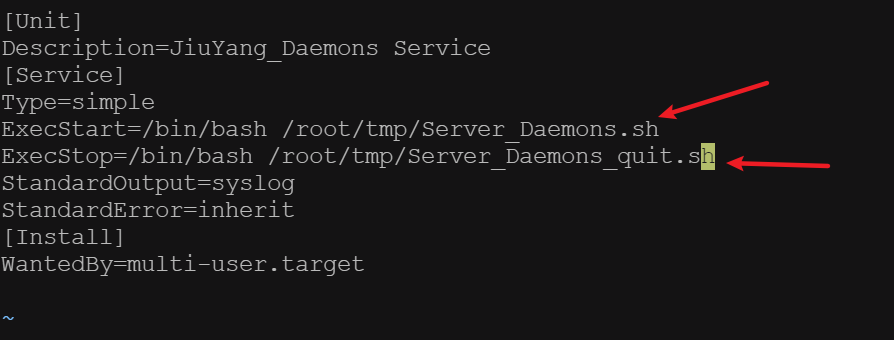
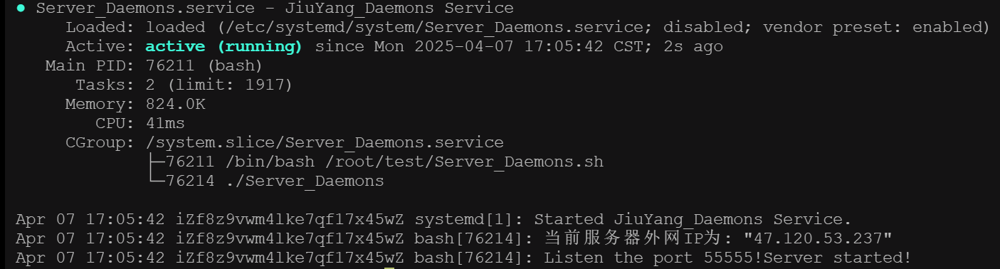

## 介绍
内网穿透集群管控系统的接入服务器部分

## 需要知识
* 服务器安全组规则
* 计算机网络
* QT

## 程序启动
1. 部署运行环境
   ```markdown
    #检查端口是否开放（默认55555）
    iptables -L -n -v | grep 55555
    
    #检查端口是否占用（默认55555）
    netstat -tuln | grep ':55555'
    
    #检查tinc软件是否下载
    tinctincd --version
    ```
2. 测试运行环境
   ```markdown
    #将Project文件夹中的Server_Daemons文件上传到服务器，运行以下命令
    chmod +x Server_Daemons
    ./Server_Daemons
    
    #若出现以下说明，则表示守护进程运行成功
   ```
   
3. 修改文件内容
   ```markdown
   #将Project文件夹中的Server_Daemons.service，Server_Daemons.sh，Server_Daemons_quit.sh文件上传到服务器
   
   #目录结构如下：
   ---Folder
   |--Server_Daemons.sh
   |--Server_Daemons_quit.sh
   |--Server_Daemons

   #修改Server_Daemons.service中的路径为实际路径，如下图所示
    ```
    
4. 注册为守护进程
   ```markdown
   #将Server_Daemons.service文件复制于/etc/systemd/system/路径下
   cp Server_Daemons.service /etc/systemd/system/
      
   #启动服务
   systemctl start Server_Daemons.service

   #查看服务状态
   systemctl status Server_Daemons.service

   #若如下图所示，则表示服务启动成功
   ```
   

## 程序编译
1. 部署编译环境
   ```markdown
   #安装QT基础组件
   sudo apt install -y qtbase5-dev qt5-qmake 

   #检查编译环境
   qmake -v
   ```
2. 下载源代码并编译
   ```markdown
   #下载SourceCode文件夹中的所有文件

   #移动至根目录

   #编译代码
   qmake
   make
   ```